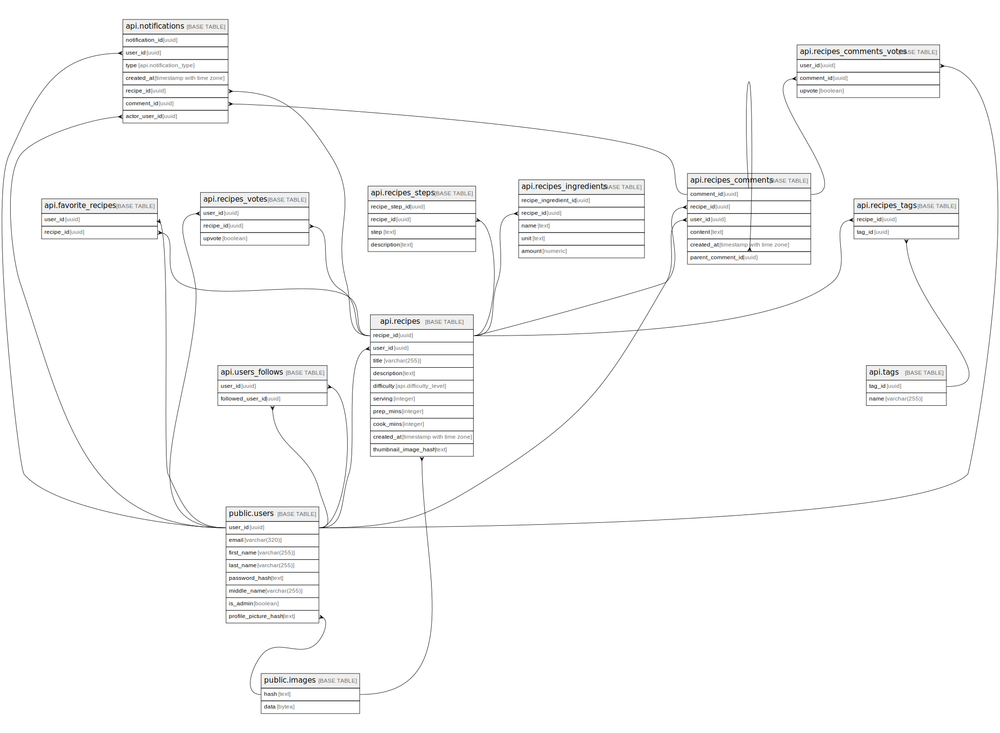

# recipedb

## Tables

| Name | Columns | Comment | Type |
| ---- | ------- | ------- | ---- |
| [public.users](public.users.md) | 7 |  | BASE TABLE |
| [api.recipes](api.recipes.md) | 6 |  | BASE TABLE |
| [api.recipes_comments](api.recipes_comments.md) | 5 |  | BASE TABLE |
| [api.recipes_comments_votes](api.recipes_comments_votes.md) | 3 |  | BASE TABLE |
| [api.tags](api.tags.md) | 2 |  | BASE TABLE |
| [api.recipes_tags](api.recipes_tags.md) | 2 |  | BASE TABLE |
| [api.users_recipe_votes](api.users_recipe_votes.md) | 3 |  | BASE TABLE |
| [api.favorite_recipes](api.favorite_recipes.md) | 2 |  | BASE TABLE |
| [public.images](public.images.md) | 2 |  | BASE TABLE |

## Stored procedures and functions

| Name | ReturnType | Arguments | Type |
| ---- | ------- | ------- | ---- |
| api.login | json | email text, password text | FUNCTION |
| api.signup | void | email text, password text, first_name text, last_name text, middle_name text DEFAULT NULL::text | FUNCTION |
| auth.is_admin | bool |  | FUNCTION |
| auth.user_id | uuid |  | FUNCTION |
| auth.owns_recipe | bool | target_recipe_id uuid | FUNCTION |
| public.digest | bytea | text, text | FUNCTION |
| public.digest | bytea | bytea, text | FUNCTION |
| public.hmac | bytea | text, text, text | FUNCTION |
| public.hmac | bytea | bytea, bytea, text | FUNCTION |
| public.crypt | text | text, text | FUNCTION |
| public.gen_salt | text | text | FUNCTION |
| public.gen_salt | text | text, integer | FUNCTION |
| public.encrypt | bytea | bytea, bytea, text | FUNCTION |
| public.decrypt | bytea | bytea, bytea, text | FUNCTION |
| public.encrypt_iv | bytea | bytea, bytea, bytea, text | FUNCTION |
| public.decrypt_iv | bytea | bytea, bytea, bytea, text | FUNCTION |
| public.gen_random_bytes | bytea | integer | FUNCTION |
| public.gen_random_uuid | uuid |  | FUNCTION |
| public.pgp_sym_encrypt | bytea | text, text | FUNCTION |
| public.pgp_sym_encrypt_bytea | bytea | bytea, text | FUNCTION |
| public.pgp_sym_encrypt | bytea | text, text, text | FUNCTION |
| public.pgp_sym_encrypt_bytea | bytea | bytea, text, text | FUNCTION |
| public.pgp_sym_decrypt | text | bytea, text | FUNCTION |
| public.pgp_sym_decrypt_bytea | bytea | bytea, text | FUNCTION |
| public.pgp_sym_decrypt | text | bytea, text, text | FUNCTION |
| public.pgp_sym_decrypt_bytea | bytea | bytea, text, text | FUNCTION |
| public.pgp_pub_encrypt | bytea | text, bytea | FUNCTION |
| public.pgp_pub_encrypt_bytea | bytea | bytea, bytea | FUNCTION |
| public.pgp_pub_encrypt | bytea | text, bytea, text | FUNCTION |
| public.pgp_pub_encrypt_bytea | bytea | bytea, bytea, text | FUNCTION |
| public.pgp_pub_decrypt | text | bytea, bytea | FUNCTION |
| public.pgp_pub_decrypt_bytea | bytea | bytea, bytea | FUNCTION |
| public.pgp_pub_decrypt | text | bytea, bytea, text | FUNCTION |
| public.pgp_pub_decrypt_bytea | bytea | bytea, bytea, text | FUNCTION |
| public.pgp_pub_decrypt | text | bytea, bytea, text, text | FUNCTION |
| public.pgp_pub_decrypt_bytea | bytea | bytea, bytea, text, text | FUNCTION |
| public.pgp_key_id | text | bytea | FUNCTION |
| public.armor | text | bytea | FUNCTION |
| public.armor | text | bytea, text[], text[] | FUNCTION |
| public.dearmor | bytea | text | FUNCTION |
| public.pgp_armor_headers | record | text, OUT key text, OUT value text | FUNCTION |
| api.change_password | void | new_password text | FUNCTION |
| api.change_self | void | new_first_name character varying DEFAULT NULL::character varying, new_last_name character varying DEFAULT NULL::character varying, new_middle_name character varying DEFAULT NULL::character varying | FUNCTION |
| api.self_info | record |  | FUNCTION |
| api.user_info | record | target_id uuid | FUNCTION |
| api.get_image | application/octet-stream | image_hash text | FUNCTION |
| api.upload_image | text | image_data bytea | FUNCTION |

## Enums

| Name | Values |
| ---- | ------- |
| api.difficulty_level | Advanced, Beginner, Easy, Expert, Intermediate |
| pgschema_tmp_20260622_091016_b94231b8.difficulty_level | Advanced, Beginner, Easy, Expert, Intermediate |
| pgschema_tmp_20260622_183335_363ae4df.difficulty_level | Advanced, Beginner, Easy, Expert, Intermediate |

## Relations

---

> Generated by [tbls](https://github.com/k1LoW/tbls)
