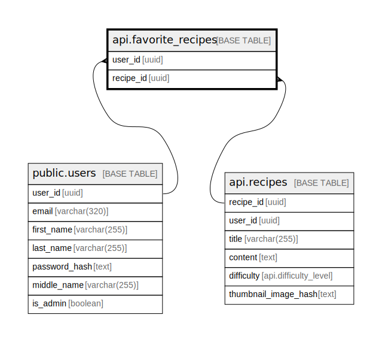

# api.favorite_recipes

## Columns

| Name | Type | Default | Nullable | Children | Parents | Comment |
| ---- | ---- | ------- | -------- | -------- | ------- | ------- |
| user_id | uuid |  | false |  | [public.users](public.users.md) |  |
| recipe_id | uuid |  | false |  | [api.recipes](api.recipes.md) |  |

## Constraints

| Name | Type | Definition |
| ---- | ---- | ---------- |
| favorite_recipes_user_id_fkey | FOREIGN KEY | FOREIGN KEY (user_id) REFERENCES users(user_id) ON DELETE CASCADE |
| favorite_recipes_recipe_id_fkey | FOREIGN KEY | FOREIGN KEY (recipe_id) REFERENCES api.recipes(recipe_id) ON DELETE CASCADE |
| favorite_recipes_pkey | PRIMARY KEY | PRIMARY KEY (user_id, recipe_id) |

## Indexes

| Name | Definition |
| ---- | ---------- |
| favorite_recipes_pkey | CREATE UNIQUE INDEX favorite_recipes_pkey ON api.favorite_recipes USING btree (user_id, recipe_id) |

## Relations

---

> Generated by [tbls](https://github.com/k1LoW/tbls)
