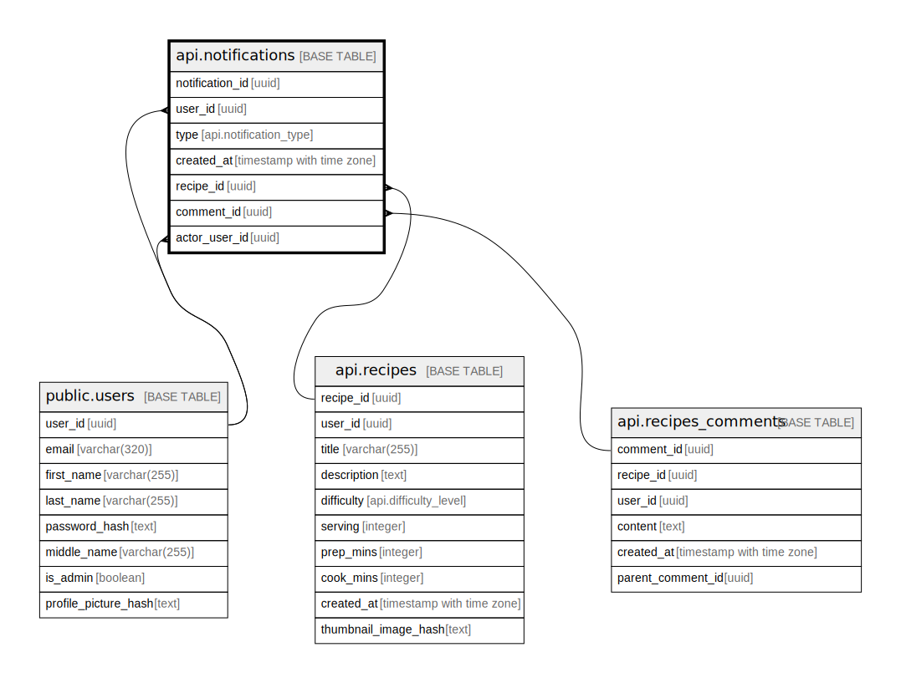

# api.notifications

## Columns

| Name | Type | Default | Nullable | Children | Parents | Comment |
| ---- | ---- | ------- | -------- | -------- | ------- | ------- |
| notification_id | uuid | gen_random_uuid() | false |  |  |  |
| user_id | uuid |  | false |  | [public.users](public.users.md) |  |
| type | api.notification_type |  | false |  |  |  |
| created_at | timestamp with time zone | now() | false |  |  |  |
| recipe_id | uuid |  | true |  | [api.recipes](api.recipes.md) |  |
| comment_id | uuid |  | true |  | [api.recipes_comments](api.recipes_comments.md) |  |
| actor_user_id | uuid |  | true |  | [public.users](public.users.md) |  |

## Constraints

| Name | Type | Definition |
| ---- | ---- | ---------- |
| notifications_actor_user_id_fkey | FOREIGN KEY | FOREIGN KEY (actor_user_id) REFERENCES users(user_id) ON DELETE CASCADE |
| notifications_user_id_fkey | FOREIGN KEY | FOREIGN KEY (user_id) REFERENCES users(user_id) ON DELETE CASCADE |
| notifications_recipe_id_fkey | FOREIGN KEY | FOREIGN KEY (recipe_id) REFERENCES api.recipes(recipe_id) ON DELETE CASCADE |
| notifications_comment_id_fkey | FOREIGN KEY | FOREIGN KEY (comment_id) REFERENCES api.recipes_comments(comment_id) ON DELETE CASCADE |
| notifications_pkey | PRIMARY KEY | PRIMARY KEY (notification_id) |

## Indexes

| Name | Definition |
| ---- | ---------- |
| notifications_pkey | CREATE UNIQUE INDEX notifications_pkey ON api.notifications USING btree (notification_id) |
| notifications_user_id_created_at_idx | CREATE INDEX notifications_user_id_created_at_idx ON api.notifications USING btree (user_id, created_at DESC) |

## Relations

---

> Generated by [tbls](https://github.com/k1LoW/tbls)
