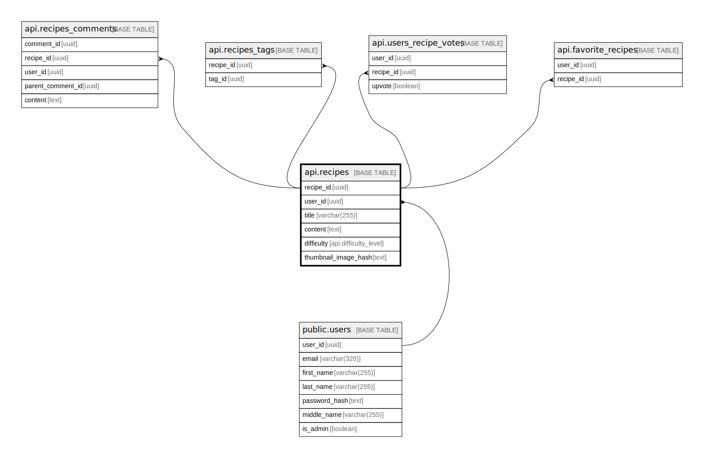

# api.recipes

## Columns

| Name | Type | Default | Nullable | Children | Parents | Comment |
| ---- | ---- | ------- | -------- | -------- | ------- | ------- |
| recipe_id | uuid | gen_random_uuid() | false | [api.recipes_comments](api.recipes_comments.md) [api.recipes_tags](api.recipes_tags.md) [api.users_recipe_votes](api.users_recipe_votes.md) [api.favorite_recipes](api.favorite_recipes.md) |  |  |
| user_id | uuid |  | false |  | [public.users](public.users.md) |  |
| title | varchar(255) |  | false |  |  |  |
| content | text |  | false |  |  |  |
| difficulty | api.difficulty_level |  | false |  |  |  |
| thumbnail_image_hash | text |  | true |  |  |  |

## Constraints

| Name | Type | Definition |
| ---- | ---- | ---------- |
| recipes_user_id_fkey | FOREIGN KEY | FOREIGN KEY (user_id) REFERENCES users(user_id) ON DELETE CASCADE |
| recipes_pkey | PRIMARY KEY | PRIMARY KEY (recipe_id) |

## Indexes

| Name | Definition |
| ---- | ---------- |
| recipes_pkey | CREATE UNIQUE INDEX recipes_pkey ON api.recipes USING btree (recipe_id) |

## Relations

---

> Generated by [tbls](https://github.com/k1LoW/tbls)
