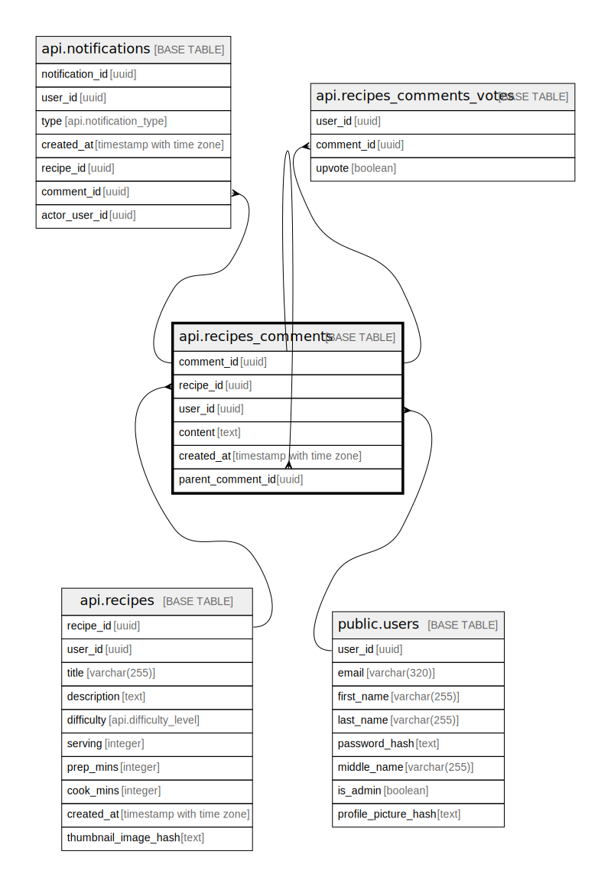

# api.recipes_comments

## Columns

| Name | Type | Default | Nullable | Children | Parents | Comment |
| ---- | ---- | ------- | -------- | -------- | ------- | ------- |
| comment_id | uuid | gen_random_uuid() | false | [api.recipes_comments](api.recipes_comments.md) [api.recipes_comments_votes](api.recipes_comments_votes.md) |  |  |
| recipe_id | uuid |  | false | [api.recipes_comments](api.recipes_comments.md) | [api.recipes](api.recipes.md) [api.recipes_comments](api.recipes_comments.md) |  |
| user_id | uuid |  | false |  | [public.users](public.users.md) |  |
| parent_comment_id | uuid |  | true |  | [api.recipes_comments](api.recipes_comments.md) |  |
| content | text |  | false |  |  |  |

## Constraints

| Name | Type | Definition |
| ---- | ---- | ---------- |
| recipes_comments_user_id_fkey | FOREIGN KEY | FOREIGN KEY (user_id) REFERENCES users(user_id) ON DELETE CASCADE |
| recipes_comments_recipe_id_fkey | FOREIGN KEY | FOREIGN KEY (recipe_id) REFERENCES api.recipes(recipe_id) ON DELETE CASCADE |
| recipes_comments_pkey | PRIMARY KEY | PRIMARY KEY (comment_id) |
| recipes_comments_comment_id_recipe_id_key | UNIQUE | UNIQUE (comment_id, recipe_id) |
| recipes_comments_parent_comment_id_recipe_id_fkey | FOREIGN KEY | FOREIGN KEY (parent_comment_id, recipe_id) REFERENCES api.recipes_comments(comment_id, recipe_id) ON DELETE SET NULL |

## Indexes

| Name | Definition |
| ---- | ---------- |
| recipes_comments_pkey | CREATE UNIQUE INDEX recipes_comments_pkey ON api.recipes_comments USING btree (comment_id) |
| recipes_comments_comment_id_recipe_id_key | CREATE UNIQUE INDEX recipes_comments_comment_id_recipe_id_key ON api.recipes_comments USING btree (comment_id, recipe_id) |

## Relations

---

> Generated by [tbls](https://github.com/k1LoW/tbls)
