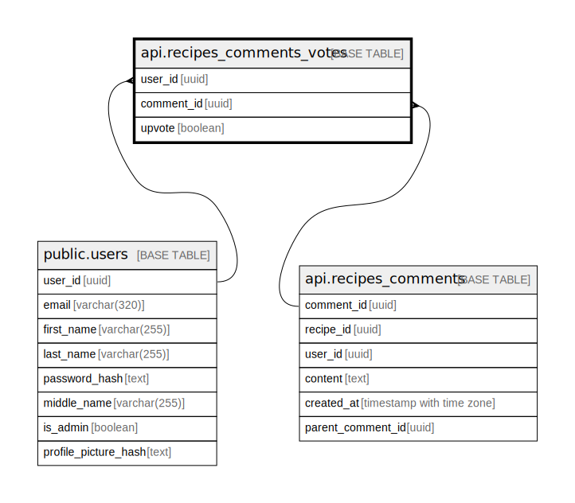

# api.recipes_comments_votes

## Columns

| Name | Type | Default | Nullable | Children | Parents | Comment |
| ---- | ---- | ------- | -------- | -------- | ------- | ------- |
| user_id | uuid |  | false |  | [public.users](public.users.md) |  |
| comment_id | uuid |  | false |  | [api.recipes_comments](api.recipes_comments.md) |  |
| upvote | boolean |  | false |  |  |  |

## Constraints

| Name | Type | Definition |
| ---- | ---- | ---------- |
| recipes_comments_votes_user_id_fkey | FOREIGN KEY | FOREIGN KEY (user_id) REFERENCES users(user_id) ON DELETE CASCADE |
| recipes_comments_votes_comment_id_fkey | FOREIGN KEY | FOREIGN KEY (comment_id) REFERENCES api.recipes_comments(comment_id) ON DELETE CASCADE |
| recipes_comments_votes_pkey | PRIMARY KEY | PRIMARY KEY (user_id, comment_id) |

## Indexes

| Name | Definition |
| ---- | ---------- |
| recipes_comments_votes_pkey | CREATE UNIQUE INDEX recipes_comments_votes_pkey ON api.recipes_comments_votes USING btree (user_id, comment_id) |

## Triggers

| Name | Definition |
| ---- | ---------- |
| trg_notify_recipe_comment_vote | CREATE TRIGGER trg_notify_recipe_comment_vote AFTER INSERT OR UPDATE ON api.recipes_comments_votes FOR EACH ROW EXECUTE FUNCTION api.notify_recipe_comment_vote() |

## Relations

---

> Generated by [tbls](https://github.com/k1LoW/tbls)
