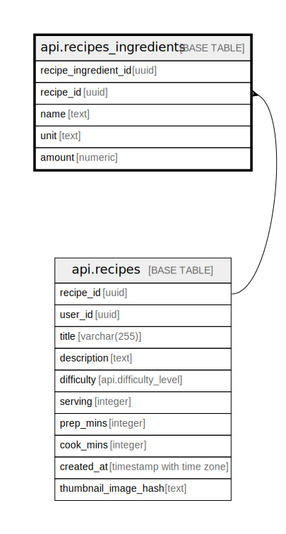

# api.recipes_ingredients

## Columns

| Name | Type | Default | Nullable | Children | Parents | Comment |
| ---- | ---- | ------- | -------- | -------- | ------- | ------- |
| recipe_ingredient_id | uuid | gen_random_uuid() | false |  |  |  |
| recipe_id | uuid |  | false |  | [api.recipes](api.recipes.md) |  |
| name | text |  | false |  |  |  |
| unit | text |  | false |  |  |  |
| amount | numeric |  | false |  |  |  |

## Constraints

| Name | Type | Definition |
| ---- | ---- | ---------- |
| recipes_ingredients_amount_check | CHECK | CHECK ((amount > (0)::numeric)) |
| recipes_ingredients_recipe_id_fkey | FOREIGN KEY | FOREIGN KEY (recipe_id) REFERENCES api.recipes(recipe_id) ON DELETE CASCADE |
| recipes_ingredients_pkey | PRIMARY KEY | PRIMARY KEY (recipe_ingredient_id) |
| recipes_ingredients_recipe_id_name_key | UNIQUE | UNIQUE (recipe_id, name) |

## Indexes

| Name | Definition |
| ---- | ---------- |
| recipes_ingredients_pkey | CREATE UNIQUE INDEX recipes_ingredients_pkey ON api.recipes_ingredients USING btree (recipe_ingredient_id) |
| recipes_ingredients_recipe_id_name_key | CREATE UNIQUE INDEX recipes_ingredients_recipe_id_name_key ON api.recipes_ingredients USING btree (recipe_id, name) |

## Relations

---

> Generated by [tbls](https://github.com/k1LoW/tbls)
