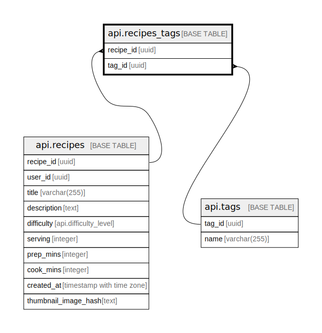

# api.recipes_tags

## Columns

| Name | Type | Default | Nullable | Children | Parents | Comment |
| ---- | ---- | ------- | -------- | -------- | ------- | ------- |
| recipe_id | uuid |  | false |  | [api.recipes](api.recipes.md) |  |
| tag_id | uuid |  | false |  | [api.tags](api.tags.md) |  |

## Constraints

| Name | Type | Definition |
| ---- | ---- | ---------- |
| recipes_tags_recipe_id_fkey | FOREIGN KEY | FOREIGN KEY (recipe_id) REFERENCES api.recipes(recipe_id) ON DELETE CASCADE |
| recipes_tags_tag_id_fkey | FOREIGN KEY | FOREIGN KEY (tag_id) REFERENCES api.tags(tag_id) ON DELETE CASCADE |
| recipes_tags_pkey | PRIMARY KEY | PRIMARY KEY (recipe_id, tag_id) |

## Indexes

| Name | Definition |
| ---- | ---------- |
| recipes_tags_pkey | CREATE UNIQUE INDEX recipes_tags_pkey ON api.recipes_tags USING btree (recipe_id, tag_id) |

## Relations

---

> Generated by [tbls](https://github.com/k1LoW/tbls)
