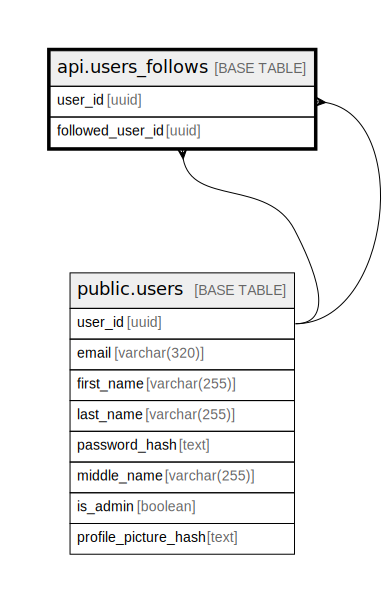

# api.users_follows

## Columns

| Name | Type | Default | Nullable | Children | Parents | Comment |
| ---- | ---- | ------- | -------- | -------- | ------- | ------- |
| user_id | uuid |  | false |  | [public.users](public.users.md) |  |
| followed_user_id | uuid |  | false |  | [public.users](public.users.md) |  |

## Constraints

| Name | Type | Definition |
| ---- | ---- | ---------- |
| users_follows_check | CHECK | CHECK ((followed_user_id <> user_id)) |
| users_follows_followed_user_id_fkey | FOREIGN KEY | FOREIGN KEY (followed_user_id) REFERENCES users(user_id) ON DELETE CASCADE |
| users_follows_user_id_fkey | FOREIGN KEY | FOREIGN KEY (user_id) REFERENCES users(user_id) ON DELETE CASCADE |
| users_follows_pkey | PRIMARY KEY | PRIMARY KEY (user_id, followed_user_id) |

## Indexes

| Name | Definition |
| ---- | ---------- |
| users_follows_pkey | CREATE UNIQUE INDEX users_follows_pkey ON api.users_follows USING btree (user_id, followed_user_id) |
| users_follows_followed_user_id_idx | CREATE INDEX users_follows_followed_user_id_idx ON api.users_follows USING btree (followed_user_id) |

## Triggers

| Name | Definition |
| ---- | ---------- |
| trg_notify_insert_user_follow | CREATE TRIGGER trg_notify_insert_user_follow AFTER INSERT ON api.users_follows FOR EACH ROW EXECUTE FUNCTION api.notify_insert_user_follow() |

## Relations

---

> Generated by [tbls](https://github.com/k1LoW/tbls)
