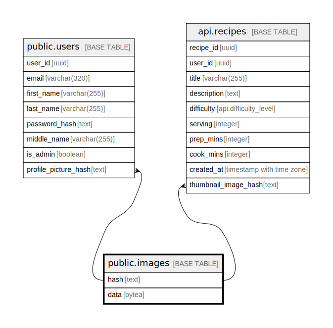

# public.images

## Columns

| Name | Type | Default | Nullable | Children | Parents | Comment |
| ---- | ---- | ------- | -------- | -------- | ------- | ------- |
| hash | text |  | false | [public.users](public.users.md) [api.recipes](api.recipes.md) |  |  |
| data | bytea |  | false |  |  |  |

## Constraints

| Name | Type | Definition |
| ---- | ---- | ---------- |
| images_pkey | PRIMARY KEY | PRIMARY KEY (hash) |

## Indexes

| Name | Definition |
| ---- | ---------- |
| images_pkey | CREATE UNIQUE INDEX images_pkey ON public.images USING btree (hash) |

## Relations

---

> Generated by [tbls](https://github.com/k1LoW/tbls)
