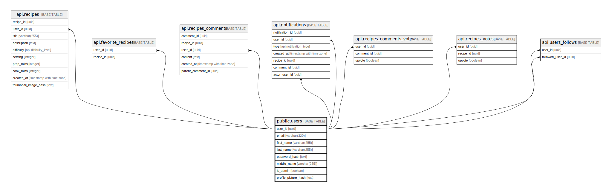

# public.users

## Columns

| Name | Type | Default | Nullable | Children | Parents | Comment |
| ---- | ---- | ------- | -------- | -------- | ------- | ------- |
| user_id | uuid | gen_random_uuid() | false | [api.recipes](api.recipes.md) [api.favorite_recipes](api.favorite_recipes.md) [api.recipes_comments](api.recipes_comments.md) [api.notifications](api.notifications.md) [api.recipes_comments_votes](api.recipes_comments_votes.md) [api.recipes_votes](api.recipes_votes.md) [api.users_follows](api.users_follows.md) |  |  |
| email | varchar(320) |  | false |  |  |  |
| first_name | varchar(255) |  | false |  |  |  |
| last_name | varchar(255) |  | false |  |  |  |
| password_hash | text |  | false |  |  |  |
| middle_name | varchar(255) |  | true |  |  |  |
| is_admin | boolean | false | false |  |  |  |
| profile_picture_hash | text |  | true |  | [public.images](public.images.md) |  |

## Constraints

| Name | Type | Definition |
| ---- | ---- | ---------- |
| users_pkey | PRIMARY KEY | PRIMARY KEY (user_id) |
| users_email_key | UNIQUE | UNIQUE (email) |
| users_profile_picture_hash_fkey | FOREIGN KEY | FOREIGN KEY (profile_picture_hash) REFERENCES images(hash) |

## Indexes

| Name | Definition |
| ---- | ---------- |
| users_pkey | CREATE UNIQUE INDEX users_pkey ON public.users USING btree (user_id) |
| users_email_key | CREATE UNIQUE INDEX users_email_key ON public.users USING btree (email) |

## Relations

---

> Generated by [tbls](https://github.com/k1LoW/tbls)
